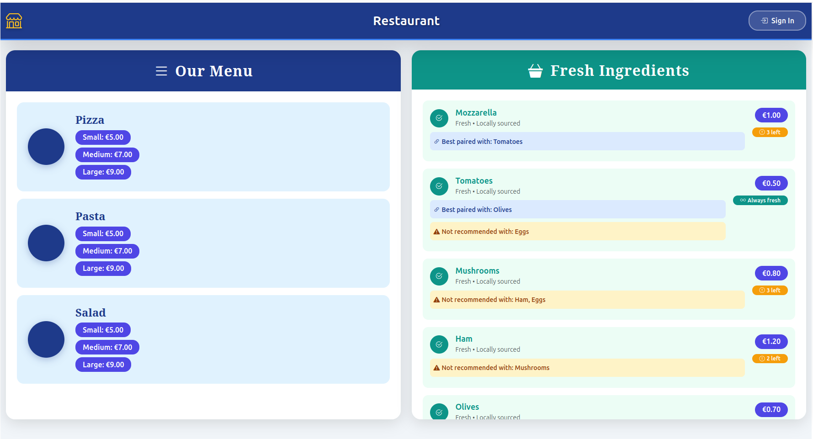
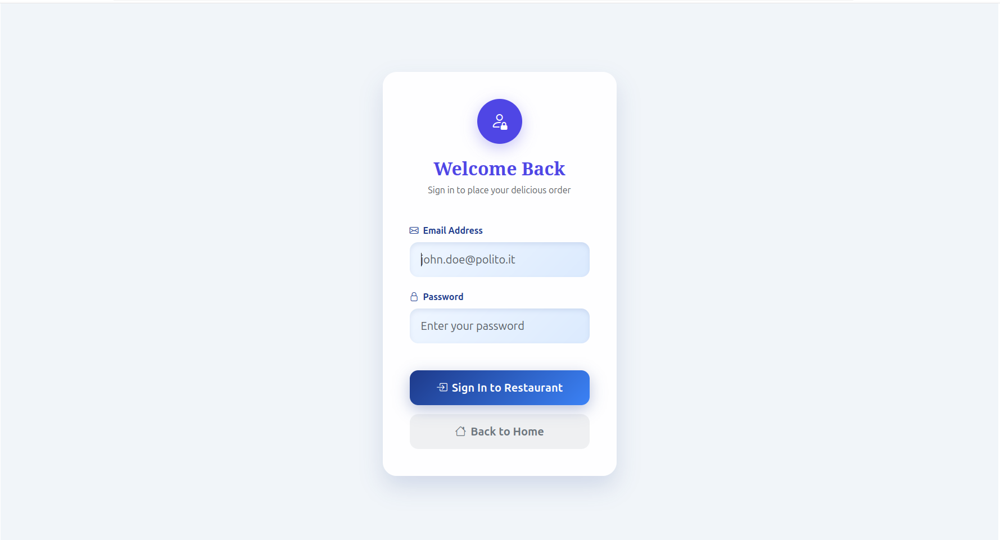
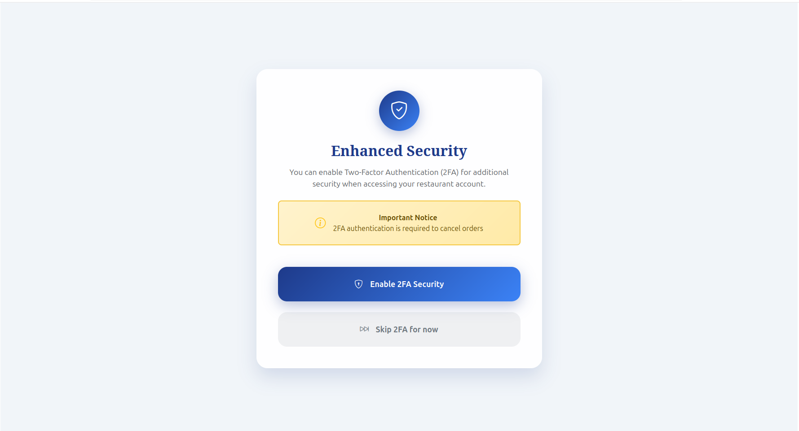
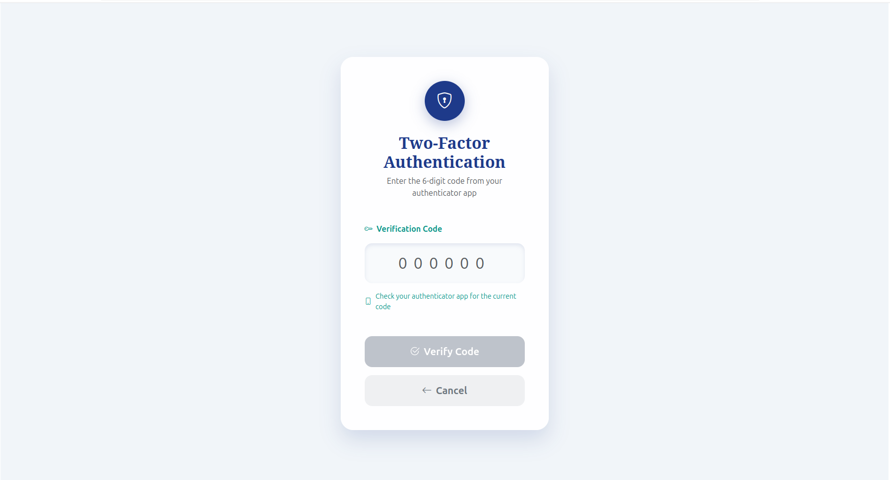
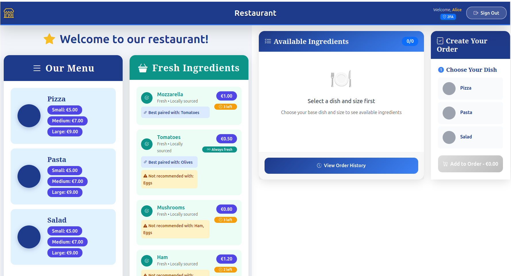
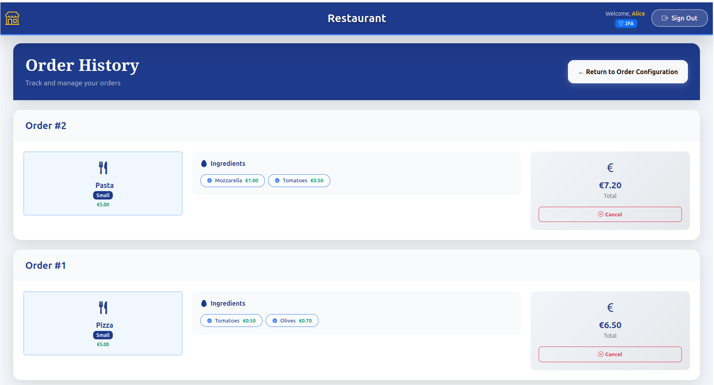

# Exam 2: "Restaurant Web Application"

## Student: s334007 EMANUEL FABRIZIO

## React Client Application Routes

- Route `/`: Public page with base dishes and their size, and ingredients with login button for non authenticated users
- Route `/login`: User login page with optional 2FA setup choice - handles authentication flow
- Route `/totp`: TOTP (2FA) verification page for token input - requires initial login
- Route `/orders`: Order configuration page with ingredient selection and constraint validation - authenticated users only
- Route `/history`: Order history page with detailed view and cancellation functionality - authenticated users only

## API Server

- POST `/api/sessions`
  - Description: Authenticate user with email and password
  - request body: `{"username": "alice@example.com", "password": "password"}`
  - response body: `{"id": 1, "email": "alice@example.com", "name": "Alice", "canDoTotp": true}`

- GET `/api/basedishes`
  - Description: Get all base dishes available in the restaurant
  - request parameters: none
  - response body: `[{"id": 1, "name": "Pizza"}, {"id": 2, "name": "Pasta"}, {"id": 3, "name": "Salad"}]`

- GET `/api/ingredients`
  - Description: Get all ingredients with prices, availability, dependencies and incompatibilities
  - request parameters: none
  - response body: `[{"id": 1, "name": "Mozzarella", "price": 1.00, "availability": 3, "dependencies": ["Tomatoes"], "incompatibilities": []}, {"id": 7, "name": "Eggs", "price": 1.00, "availability": null, "dependencies": [], "incompatibilities": ["Mushrooms", "Tomatoes"]}]`

- GET `/api/sizes`
  - Description: Get all available sizes with prices and ingredient limits
  - request parameters: none
  - response body: `[{"id": 1, "name": "Small", "price": 5.00, "max_ingredients": 3}, {"id": 2, "name": "Medium", "price": 7.00, "max_ingredients": 5}, {"id": 3, "name": "Large", "price": 9.00, "max_ingredients": 7}]`

- GET `/api/orders`
  - Description: Get all orders for the authenticated user with detailed information
  - request parameters: none (requires authentication)
  - response body: `[{"id": 1, "dishId": 1, "dish": "Pizza", "size": "Small", "sizeId": 1, "sizePrice": 5.00, "ingredients": [{"id": 2, "name": "Tomatoes", "price": 0.50}, {"id": 5, "name": "Olives", "price": 0.70}], "total": 6.20}]`

- POST `/api/orders`
  - Description: Create a new order for the authenticated user (validates ingredients constraints, availability, and size limits)
  - request body: `{"dishId": 1, "sizeId": 2, "ingredients": [{"id": 1, "name": "Mozzarella", "price": 1.00}, {"id": 2, "name": "Tomatoes", "price": 0.50}], "total": 8.50}`
  - response body: `{"id": 5, "dishId": 1, "sizeId": 2, "dish": "Pizza", "size": "Medium", "sizePrice": 7.00, "ingredients": [{"id": 1, "name": "Mozzarella", "price": 1.00}, {"id": 2, "name": "Tomatoes", "price": 0.50}], "total": 8.50}`

- DELETE `/api/orders/:id`
  - Description: Cancel an existing order (requires 2FA authentication) and restore ingredient availability
  - request parameters: order id in URL path (requires 2FA authentication)
  - request body: none
  - response body: `{"message": "Order cancelled successfully", "changes": 1}`

- POST `/api/login-totp`
  - Description: Verify TOTP token for 2FA authentication using secret LXBSMDTMSP2I5XFXIYRGFVWSFI
  - request body: `{"token": "123456"}`
  - response body: `{"otp": "authorized"}`

- GET `/api/sessions/current`
  - Description: Get information about the current authenticated user
  - request parameters: none
  - response body: `{"id": 1, "email": "alice@example.com", "name": "Alice", "canDoTotp": true, "isTotp": true}`

- DELETE `/api/sessions/current`
  - Description: Logout the current user and destroy session
  - request parameters: none
  - request body: none
  - response body: `{}`

## Database Tables

- Table `users` - contains user accounts with authentication data and 2FA settings (id, email, name, hash, salt, secret)
- Table `basedishes` - contains base dishes (Pizza, Pasta, Salad) (id, name)
- Table `sizes` - contains available sizes with prices and ingredient limits (id, name, price, max_ingredients)
- Table `ingredients` - contains available ingredients with prices and availability limits (id, name, price, availability)
- Table `ingredient_dependencies` - contains required ingredient relationships (ingredient_id, depends_on_id)
- Table `ingredient_incompatibilities` - contains incompatible ingredient pairs (ingredient1_id, ingredient2_id)
- Table `orders` - contains customer orders with dish, size, total price (id, user_id, dish_id, size_id, total)
- Table `order_ingredients` - contains many-to-many relationship between orders and selected ingredients (order_id, ingredient_id)

## Main React Components

### Core Application Components
- **`App`** (in `App.jsx`): Main application component with routing, global state management, and authentication handling
- **`GenericLayout`** (in `Layout.jsx`): Main layout with navigation, shared state, and order configurator

### Order Management Components
- **`OrderConfigurator`** (in `OrderConfigurator.jsx`): Main order configuration component with two-panel layout, real-time constraint validation, dynamic size selection, and live price calculation
- **`OrderHistory`** (in `OrderHistory.jsx`): Order history display with detailed ingredient breakdown, size price display, and order cancellation with 2FA requirement

### Authentication Components
- **`LoginForm`** (in `Auth.jsx`): User login form with credential validation
- **`LoginWithTotp`** (in `Auth.jsx`): TOTP verification form for 2FA authentication

### Navigation Components
- **`Navigation`** (in `Navigation.jsx`): Navigation bar with responsive design and login/logout functionality

## Main React Components

### Core Application
- **App** (`src/App.jsx`) - Main application with routing and state management
- **GenericLayout** (`Layout.jsx`) - Main layout wrapper with navigation

### Order Management
- **OrderConfigurator** (`OrderConfigurator.jsx`) - Order creation and configuration interface
- **OrderHistory** (`OrderHistory.jsx`) - Order history display and management

### Authentication
- **LoginWithTotp** (`src/App.jsx`) - Login component with TOTP choice logic
- **ChooseTotpLayout** (`Layout.jsx`) - TOTP choice selection layout
- **LoginForm** (`Auth.jsx`) - User login form with credential validation
- **TotpForm** (`Auth.jsx`) - TOTP verification form for 2FA

### Navigation & UI
- **Navigation** (`Navigation.jsx`) - Application navigation bar
- **MenuLayout** (`Layout.jsx`) - Home page menu display

## Screenshots

### Home Page - Public Menu

### Standard Login

### 2FA Choice

### TOTP Verification

### Order Configurator

### Order History

## Users Credentials

- alice@example.com, password1 (Alice, 2FA enabled - can cancel orders with TOTP)
- bob@example.com, password2 (Bob, 2FA disabled - standard user without 2FA)
- carol@example.com, password3 (Carol, 2FA enabled - can cancel orders with TOTP)
- dave@example.com, password4 (Dave, 2FA disabled - standard user without 2FA)